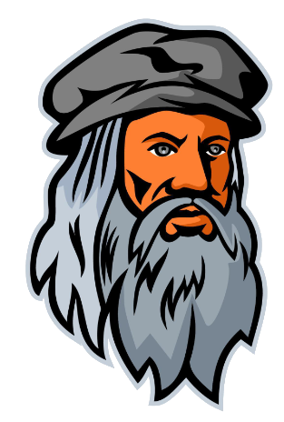

<h1 align="center">
   
  
   
  DreamPainter 🖌️
   
</h1>

  
  
  
  
  
  

A stable diffussion SaaS The project contains:

- [X] [Stable Difussion model pretrained](https://github.com/CompVis/stable-diffusion)
- [X] Platform to set sentence and get image generated
- [X] Scan QR and download image
- [ ] Set watemarker to images
- [ ] Pass by Captcha

### References 
Model pretrained: Robin Rombach and Andreas Blattmann and Dominik Lorenz and Patrick Esser and Björn Ommer
